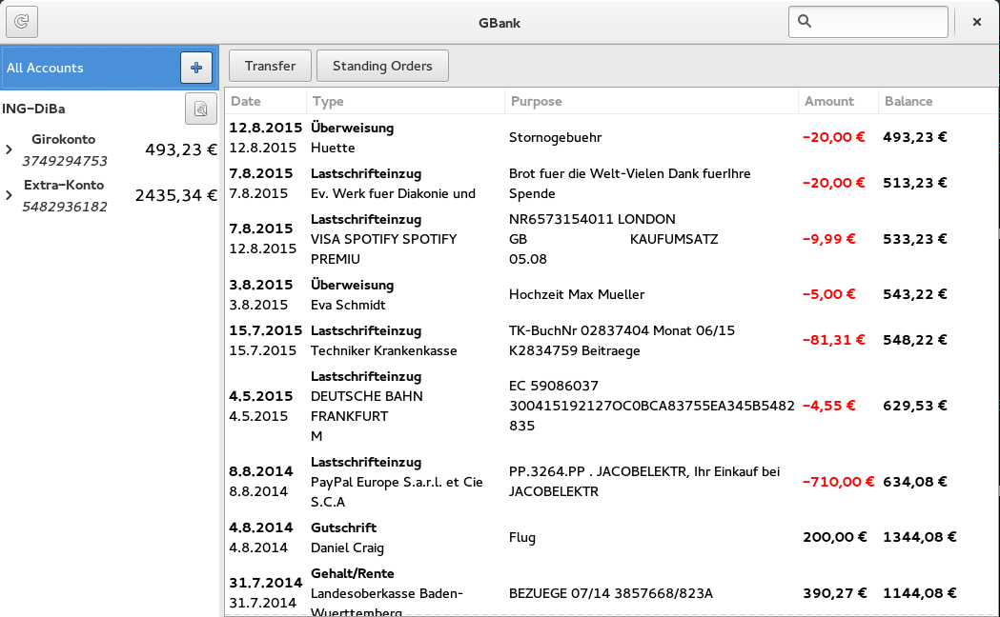

# GBank

Simple GTK client for online banking using the german protocol HBCI

## Warning

> This is work in progress, use at own risk.

## Features

* Manage multiple accounts at different banks
* Uses German HBCI Online Banking Protocol
* Display balances
* List transactions
* Search transactions
* Issue new transaction
* TAN-Methods: iTAN or mobileTAN, chipTAN (Flicker code)

## Screenshot

## Dependencies

* hbci4java-glib
* vala
* gtk+
* libgda-5.0

## Build

    ./autogen.sh
    ./configure
    make
    sudo make install
